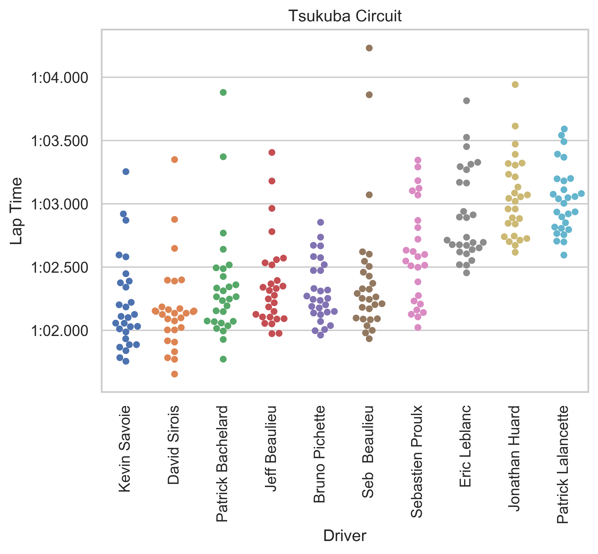

# iracing-pace

# Usage example

1. Modify config.py.example to contain iRacing username and password

2. Rename to config.py

3. Install python 3

4. Install poetry (https://poetry.eustace.io/docs/)

5. Get iracing subsession id from results page (in url, or hovering on results icon)

5. Example

        poetry run python iracing_pace/main.py 27808306 --maxpos 10 --maxdelta 3 --title "Tsukuba Circuit"

# Parameters
        C:\Users\LUNA\Desktop\Local Projects\iracing-pace>poetry run python iracing_pace\main.py -h
        usage: main.py [-h] [--maxpos MAXPOS] [--maxdelta MAXDELTA] [--violin]
                    [--title TITLE]
                    subsession

        Analyse pace from iracing race session

        positional arguments:
        subsession           Subsession ID

        optional arguments:
        -h, --help           show this help message and exit
        --maxpos MAXPOS      Minimum race position
        --maxdelta MAXDELTA  Maximum lap time delta to fastest lap
        --violin             Use violin plot instead
        --title TITLE        Title of race