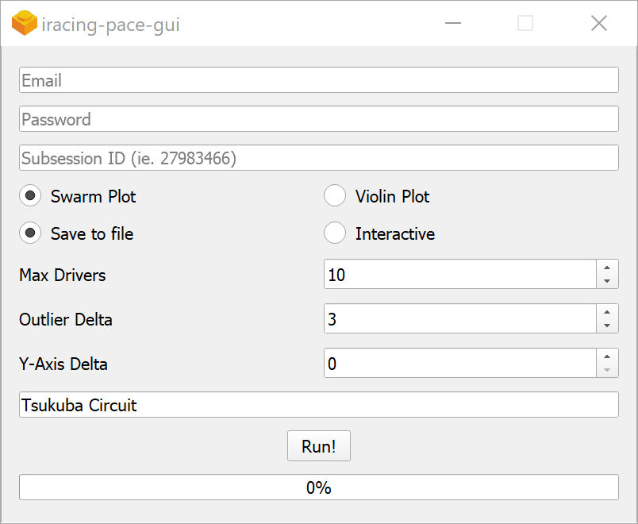

# iracing-pace

# GUI

## Installation

1. Grab either the installer or standalone binary from https://github.com/scullionw/iracing-pace/releases

## Running GUI from source

1. Install python 3

2. Install poetry (https://poetry.eustace.io/docs/)

3. Install dependencies

        poetry install

4. Navigate to gui directory
        
        cd iracing_pace\gui

5. Run build system

        poetry run fbs run

# Command line tool

## Usage example

1. Install python 3

2. Install poetry (https://poetry.eustace.io/docs/)

3. Get iracing subsession id from results page (in url, or hovering on results icon)

4. Example

        poetry run python iracing_pace/main.py 27808306 --maxpos 10 --maxdelta 3 --title "Tsukuba Circuit"

# Parameters
        λ poetry run python iracing_pace/main.py --help
        usage: main.py [-h] [--maxpos MAXPOS] [--maxdelta MAXDELTA] [--violin]
                [--reset] [--interactive] [--title TITLE]
                subsession

        Analyse pace from iracing race session

        positional arguments:
        subsession           Subsession ID

        optional arguments:
        -h, --help           show this help message and exit
        --maxpos MAXPOS      Minimum race position
        --maxdelta MAXDELTA  Maximum lap time delta to fastest lap
        --violin             Use violin plot instead
        --reset              Reset credentials
        --interactive        Interactive graph instead of saving to file
        --title TITLE        Title of race